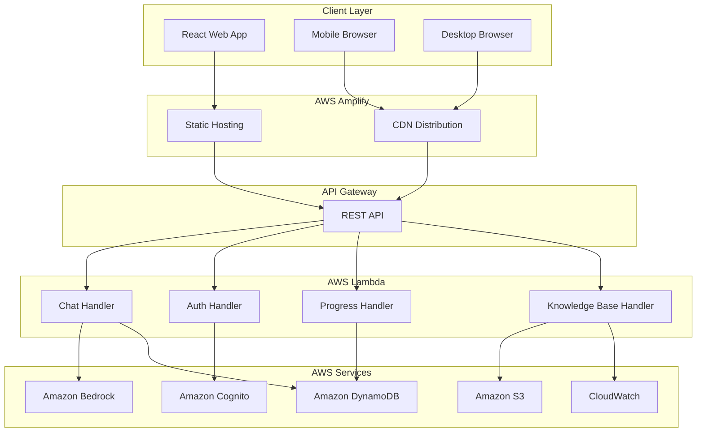

# Design Document: EducateFirstAI

## Overview

EducateFirstAI is a serverless web application built on AWS that provides AI-powered assistance for understanding FAFSA forms. The system uses a modern React frontend hosted on AWS Amplify, with a serverless backend leveraging Lambda functions, DynamoDB for data persistence, and Amazon Bedrock for AI capabilities. The architecture emphasizes cost-effectiveness by staying within AWS Free Tier limits while providing a responsive, accessible user experience.

## Architecture

### High-Level Architecture



### Component Architecture

The system follows a serverless microservices pattern with clear separation of concerns:

1. **Frontend Layer**: React SPA with responsive design
2. **API Layer**: AWS API Gateway with Lambda integration
3. **Business Logic Layer**: AWS Lambda functions for specific domains
4. **Data Layer**: DynamoDB for user data, S3 for knowledge base
5. **AI Layer**: Amazon Bedrock for natural language processing
6. **Authentication Layer**: Amazon Cognito for user management

## Components and Interfaces

### Frontend Components

#### ChatInterface Component
```typescript
interface ChatInterface {
  messages: Message[]
  currentUser: User | null
  isLoading: boolean
  
  sendMessage(content: string): Promise<void>
  clearConversation(): void
  loadConversationHistory(): Promise<Message[]>
}

interface Message {
  id: string
  content: string
  sender: 'user' | 'ai'
  timestamp: Date
  metadata?: {
    sources?: string[]
    errorDetected?: boolean
    fafsa_section?: string
  }
}
```

#### ProgressDashboard Component
```typescript
interface ProgressDashboard {
  userProgress: UserProgress
  fafsa_sections: FAFSASection[]
  
  getCompletionPercentage(): number
  getExploredSections(): FAFSASection[]
  markSectionAsReviewed(sectionId: string): Promise<void>
}

interface UserProgress {
  userId: string
  exploredSections: string[]
  lastActivity: Date
  totalQuestions: number
}
```

#### AuthenticationComponent
```typescript
interface AuthenticationComponent {
  currentUser: User | null
  isAuthenticated: boolean
  
  signUp(email: string, password: string): Promise<User>
  signIn(email: string, password: string): Promise<User>
  signOut(): Promise<void>
  resetPassword(email: string): Promise<void>
  continueAsGuest(): void
}
```

### Backend API Interfaces

#### Chat API
```typescript
interface ChatAPI {
  POST /api/chat/message: {
    request: {
      content: string
      userId?: string
      conversationId?: string
    }
    response: {
      message: Message
      sources?: string[]
      errorWarnings?: string[]
    }
  }
  
  GET /api/chat/history: {
    request: {
      userId: string
      limit?: number
    }
    response: {
      messages: Message[]
      hasMore: boolean
    }
  }
}
```

#### Progress API
```typescript
interface ProgressAPI {
  GET /api/progress/{userId}: {
    response: UserProgress
  }
  
  PUT /api/progress/{userId}/section: {
    request: {
      sectionId: string
      action: 'mark_reviewed' | 'add_question'
    }
    response: {
      success: boolean
      updatedProgress: UserProgress
    }
  }
}
```

#### Knowledge Base API
```typescript
interface KnowledgeBaseAPI {
  GET /api/knowledge/search: {
    request: {
      query: string
      section?: string
    }
    response: {
      results: KnowledgeItem[]
      relevanceScore: number
    }
  }
}

interface KnowledgeItem {
  id: string
  title: string
  content: string
  source: string
  fafsa_section: string
  commonErrors?: string[]
}
```

## Data Models

### User Data Model
```typescript
interface User {
  userId: string
  email: string
  createdAt: Date
  lastLoginAt: Date
  preferences: {
    theme: 'light' | 'dark'
    notifications: boolean
  }
  isGuest: boolean
}
```

### Conversation Data Model
```typescript
interface Conversation {
  conversationId: string
  userId: string
  messages: Message[]
  createdAt: Date
  lastUpdatedAt: Date
  expiresAt: Date // 24 hours from creation
}
```

### Progress Data Model
```typescript
interface UserProgress {
  userId: string
  exploredSections: {
    sectionId: string
    questionsAsked: number
    lastVisited: Date
    isComplete: boolean
  }[]
  totalInteractions: number
  createdAt: Date
  updatedAt: Date
}
```

### Knowledge Base Data Model
```typescript
interface FAFSADocument {
  documentId: string
  title: string
  content: string
  section: string
  subsection?: string
  sourceUrl: string
  lastUpdated: Date
  commonErrors: string[]
  keywords: string[]
}
```

### DynamoDB Table Schemas

#### Users Table
- **Partition Key**: userId (String)
- **Attributes**: email, createdAt, lastLoginAt, preferences, isGuest
- **GSI**: email-index for login lookups

#### Conversations Table
- **Partition Key**: conversationId (String)
- **Sort Key**: messageTimestamp (Number)
- **Attributes**: userId, messageContent, sender, metadata
- **TTL**: expiresAt (24 hours)
- **GSI**: userId-timestamp-index for user conversation history

#### UserProgress Table
- **Partition Key**: userId (String)
- **Attributes**: exploredSections, totalInteractions, createdAt, updatedAt

#### ResponseCache Table
- **Partition Key**: queryHash (String)
- **Attributes**: response, createdAt, hitCount
- **TTL**: expiresAt (1 hour for common queries)

### S3 Knowledge Base Structure
```
fafsa-knowledge-base/
├── official-documents/
│   ├── fafsa-guide-2024.json
│   ├── common-errors.json
│   └── field-definitions.json
├── processed/
│   ├── embeddings/
│   └── indexed/
└── updates/
    └── pending/
```
## Correctness Properties

*A property is a characteristic or behavior that should hold true across all valid executions of a system—essentially, a formal statement about what the system should do. Properties serve as the bridge between human-readable specifications and machine-verifiable correctness guarantees.*

### Input Validation Properties

**Property 1: Text Input Length Validation**
*For any* text input to the chat interface, inputs up to 5000 characters should be accepted, and inputs exceeding 5000 characters should be rejected with appropriate error messaging.
**Validates: Requirements 1.1**

**Property 2: Empty Input Rejection**
*For any* empty or whitespace-only input, the system should reject the input and display a prompt for valid content without processing.
**Validates: Requirements 1.5**

### Performance Properties

**Property 3: Response Time Consistency**
*For any* valid FAFSA question input, the system should process and respond within 3 seconds under normal load conditions.
**Validates: Requirements 1.2**

**Property 4: Initial Load Performance**
*For any* device accessing the application, the initial interface should load and become interactive within 2 seconds on standard internet connections.
**Validates: Requirements 3.5, 5.3**

### AI Response Quality Properties

**Property 5: Reading Level Compliance**
*For any* AI-generated explanation, the text should maintain a high school reading level as measured by Flesch-Kincaid readability metrics.
**Validates: Requirements 1.4, 4.1**

**Property 6: Bedrock Integration**
*For any* FAFSA question submitted, the system should successfully call Amazon Bedrock and receive a response for processing.
**Validates: Requirements 1.3**

**Property 7: Context Preservation**
*For any* follow-up question in a conversation, the AI response should reference or build upon previous messages in the same conversation thread.
**Validates: Requirements 4.4**

### UI Behavior Properties

**Property 8: Message Ordering**
*For any* conversation with multiple messages, all messages should be displayed in chronological order with clear visual distinction between user and AI messages.
**Validates: Requirements 2.1**

**Property 9: Responsive Design Adaptation**
*For any* screen width between 320px and 768px, the interface should adapt appropriately for mobile viewing, and for widths above 768px, should optimize for desktop viewing.
**Validates: Requirements 3.1, 3.2**

**Property 10: Touch Target Accessibility**
*For any* interactive element on mobile devices, the touch target should be at least 44px in both width and height.
**Validates: Requirements 3.4**

### Accessibility Properties

**Property 11: Keyboard Navigation**
*For any* interactive element in the interface, it should be reachable and operable using only keyboard navigation.
**Validates: Requirements 2.5, 7.3**

**Property 12: Color Contrast Compliance**
*For any* text and background color combination, the contrast ratio should be at least 4.5:1 to meet WCAG 2.1 AA standards.
**Validates: Requirements 7.4**

**Property 13: Screen Reader Support**
*For any* UI element, appropriate ARIA labels and semantic markup should be present for screen reader compatibility.
**Validates: Requirements 7.2**

### Data Privacy Properties

**Property 14: PII Exclusion**
*For any* user question or conversation, personally identifiable information should not be stored in persistent storage beyond the active session.
**Validates: Requirements 6.2**

**Property 15: Conversation Expiration**
*For any* conversation record, it should be automatically deleted from storage exactly 24 hours after creation.
**Validates: Requirements 6.3**

### Authentication Properties

**Property 16: Registration Requirements**
*For any* new user account creation, only email and password should be required fields.
**Validates: Requirements 9.2**

**Property 17: Session Restoration**
*For any* authenticated user logging in, their previous session data and conversation history should be restored.
**Validates: Requirements 9.3**

**Property 18: Guest Mode Functionality**
*For any* user choosing guest mode, all core chat functionality should work without requiring authentication.
**Validates: Requirements 9.5**

### Knowledge Base Properties

**Property 19: Source Attribution**
*For any* AI explanation provided, official sources should be cited when information comes from the knowledge base.
**Validates: Requirements 10.3**

**Property 20: Knowledge Base Integration**
*For any* response generation, the system should reference the stored FAFSA knowledge base to ensure accuracy.
**Validates: Requirements 10.2**

### Progress Tracking Properties

**Property 21: Progress Persistence**
*For any* returning authenticated user, previously explored FAFSA topics should be displayed in their progress dashboard.
**Validates: Requirements 11.2**

**Property 22: Section Completion Tracking**
*For any* FAFSA section that a user asks questions about, the system should mark that section as reviewed in their progress.
**Validates: Requirements 11.4**

### Caching and Optimization Properties

**Property 23: Response Caching**
*For any* common FAFSA question asked multiple times, subsequent identical queries should use cached responses to minimize Bedrock API calls.
**Validates: Requirements 12.1**

**Property 24: Resource Efficiency**
*For any* Lambda function execution, memory usage and execution time should be optimized to stay within AWS Free Tier limits.
**Validates: Requirements 12.4**

### Error Prevention Properties

**Property 25: Error Detection**
*For any* student description of their situation, the system should identify and warn about potential FAFSA errors based on common mistake patterns.
**Validates: Requirements 13.1**

**Property 26: Field-Specific Warnings**
*For any* question about a specific FAFSA field, the system should provide warnings about common pitfalls associated with that field.
**Validates: Requirements 13.5**

### Error Handling Properties

**Property 27: Service Failure Recovery**
*For any* Amazon Bedrock service unavailability, the system should display clear error messages and provide retry options.
**Validates: Requirements 8.1**

**Property 28: Network Error Detection**
*For any* network connectivity loss, the system should detect the issue and notify the user appropriately.
**Validates: Requirements 8.2**

**Property 29: Context-Preserving Retry**
*For any* failed request, the "Try Again" option should preserve the conversation context and user input.
**Validates: Requirements 8.5**

## Error Handling

### Error Categories and Responses

#### Network and Service Errors
- **Bedrock Unavailable**: Display "AI service temporarily unavailable. Please try again in a moment." with retry button
- **Network Timeout**: Show "Connection timeout. Please check your internet connection and try again."
- **API Rate Limits**: Present "High demand detected. Please wait a moment before submitting another question."

#### Input Validation Errors
- **Empty Input**: "Please enter a FAFSA question or topic you'd like help with."
- **Input Too Long**: "Please limit your question to 5000 characters or less."
- **Invalid Characters**: "Please use standard text characters in your question."

#### Authentication Errors
- **Login Failed**: "Invalid email or password. Please try again or reset your password."
- **Session Expired**: "Your session has expired. Please log in again to continue."
- **Account Creation Failed**: "Unable to create account. Please check your email format and try again."

#### Data Processing Errors
- **Knowledge Base Unavailable**: "Reference materials temporarily unavailable. Responses may be limited."
- **Progress Save Failed**: "Unable to save your progress. Your session will continue normally."
- **Cache Miss**: Gracefully fall back to live Bedrock API calls without user notification

### Error Recovery Strategies

#### Automatic Recovery
- Implement exponential backoff for API retries
- Use circuit breaker pattern for external service calls
- Maintain local state during temporary service interruptions

#### User-Initiated Recovery
- Provide clear "Try Again" buttons for failed operations
- Offer alternative actions when primary functions fail
- Maintain conversation context across retry attempts

#### Graceful Degradation
- Continue basic chat functionality when advanced features fail
- Use cached responses when live AI services are unavailable
- Provide static FAFSA information when dynamic content fails

## Testing Strategy

### Dual Testing Approach

The testing strategy employs both unit tests and property-based tests to ensure comprehensive coverage:

**Unit Tests** focus on:
- Specific examples and edge cases
- Integration points between AWS services
- Error conditions and recovery scenarios
- Authentication flows and session management

**Property-Based Tests** focus on:
- Universal properties that hold across all inputs
- Input validation across the full range of possible inputs
- Performance characteristics under various load conditions
- UI behavior across different screen sizes and devices

### Property-Based Testing Configuration

**Testing Framework**: Use **fast-check** for JavaScript/TypeScript property-based testing
- Minimum **100 iterations** per property test to ensure thorough coverage
- Each property test references its corresponding design document property
- Tag format: **Feature: educate-first-ai, Property {number}: {property_text}**

**Example Property Test Structure**:
```typescript
// Feature: educate-first-ai, Property 1: Text Input Length Validation
fc.assert(fc.property(
  fc.string({ minLength: 0, maxLength: 10000 }),
  (input) => {
    const result = validateChatInput(input);
    if (input.length <= 5000) {
      expect(result.isValid).toBe(true);
    } else {
      expect(result.isValid).toBe(false);
      expect(result.error).toContain('5000 characters');
    }
  }
), { numRuns: 100 });
```

### Integration Testing

**AWS Service Integration**:
- Test Cognito authentication flows with mock users
- Verify DynamoDB operations with test data
- Validate S3 knowledge base access and retrieval
- Test Bedrock API integration with sample queries

**End-to-End Testing**:
- Complete user journeys from registration to FAFSA assistance
- Cross-browser compatibility testing
- Mobile device testing on various screen sizes
- Accessibility testing with screen readers and keyboard navigation

### Performance Testing

**Load Testing**:
- Simulate up to 1000 concurrent users
- Test response times under various load conditions
- Verify auto-scaling behavior of Lambda functions
- Monitor AWS Free Tier usage during testing

**Accessibility Testing**:
- Automated WCAG 2.1 AA compliance checking
- Manual screen reader testing
- Keyboard navigation verification
- Color contrast validation

Each correctness property must be implemented by a single property-based test that validates the universal behavior described in the property statement.